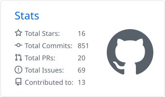
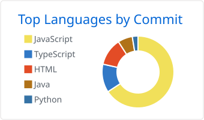

### Hi there 👋 I'm Ligengxin

**Developer | Quantitative Trading Researcher**

- 📈 Building [**outcometick**](https://outcometick.com) — historical tick data and a backtesting sandbox for Polymarket and Predict.fun crypto Up/Down markets: Chainlink settlement feeds, order books and trade prints.
  - Data subscription: <https://outcometick.com>
  - Free sample data: [polymarket-data-samples](https://github.com/Ligengxin96/polymarket-data-samples) · [predict.fun-data-samples](https://github.com/Ligengxin96/predict.fun-data-samples)
  - Strategy SDK: [TypeScript](https://github.com/outcometick/outcometick-sdk-ts) · [Python](https://github.com/outcometick/outcometick-sdk-python)
- 🔬 Researching quantitative strategies on prediction markets.
- 💬 Here is [my blog](https://blog.ligengxin.me), welcome to discuss the articles with me.

  <picture>
    <source media="(prefers-color-scheme: dark)" srcset="profile-summary-card-output/github_dark/3-stats.svg" />
    
  </picture>
  <picture>
    <source media="(prefers-color-scheme: dark)" srcset="profile-summary-card-output/github_dark/2-most-commit-language.svg" />
    
  </picture>

#### Platform&Skill

